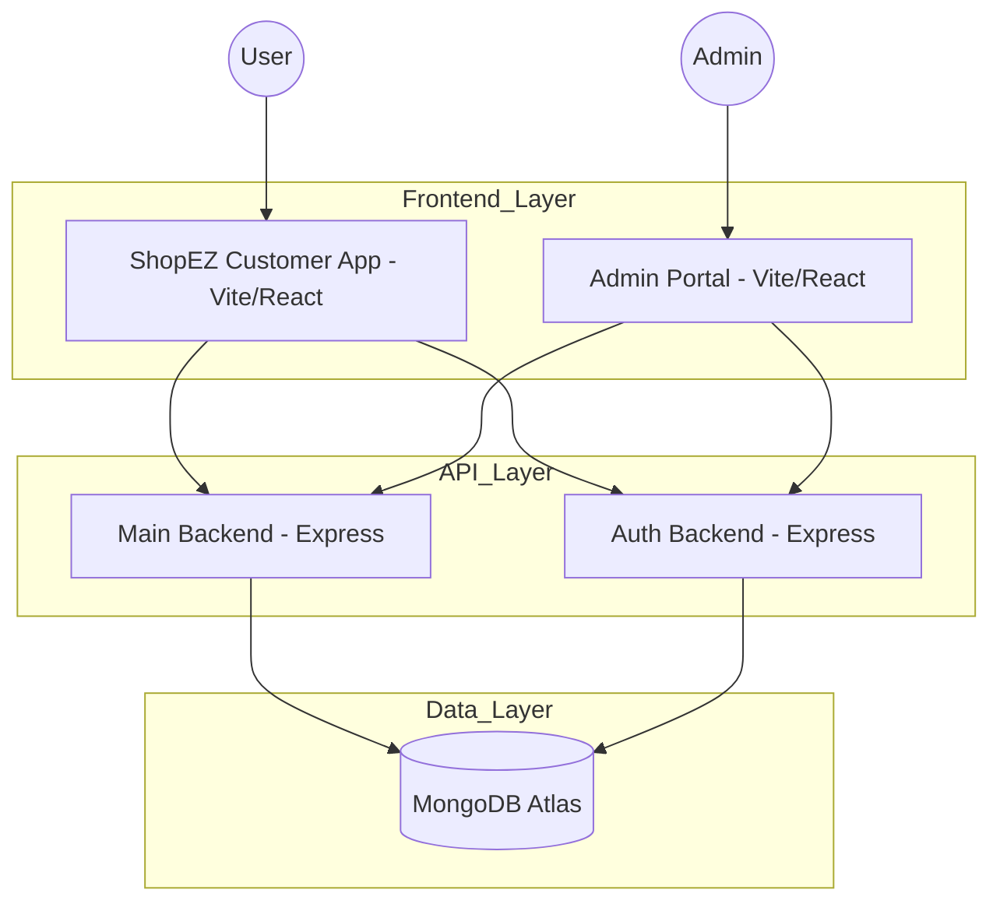

# System Architecture & MVC Pattern

This document explains the technical structure of the ShopEZ platform, detailing how it handles requests across multiple backends and separates concerns using the MVC pattern.

## 🏗️ Technical Architecture

The ShopEZ platform uses a **decoupled MERN architecture** with dual-backend services to separate core business logic from authentication services.

### Explanation:
1.  **Frontend Layer**: Two separate React applications built with Vite for high performance.
2.  **API Layer**: 
    - **Main Backend (Port 8080)**: Manages Products, Orders, Banners, and Addresses.
    - **Auth Backend (Port 5000)**: Manages User Registration, Login, and Security (JWT/OTP).
3.  **Data Layer**: A shared MongoDB database that maintains consistency across all services.

---

## 🏛️ MVC Pattern Implementation

The Agri-Tech inspired ShopEZ backend application follows the **Model-View-Controller (MVC)** architectural pattern.

### 1. Model Layer (Data Layer)
Responsible for handling all data-related logic and database schemas using **Mongoose**.
- **Location**: `backend/Models/` and `auth-app/backend/models/`
- **Responsibility**: Defines the structure of Users, Products, and Orders.

### 2. Controller Layer (Logic Layer)
Acts as the intermediary between the Routing Layer and the Model Layer.
- **Location**: `backend/Controllers/` and `auth-app/backend/Controllers/`
- **Responsibility**: Processes incoming requests, performs business logic, and interacts with the database.

### 3. View Layer (Routing Layer)
In this REST API architecture, the **Routes** act as the View Layer.
- **Location**: `backend/Routes/` and `auth-app/backend/Routes/`
- **Responsibility**: Defines HTTP endpoints (GET, POST, PUT, DELETE) and maps them to specific controller functions.

### Advantages of MVC in ShopEZ
- **Separation of Concerns**: UI developers, Backend devs, and Architects can work independently.
- **Scalability**: New features like "Wishlists" can be added by simply creating new Models, Controllers, and Routes.
- **Maintainability**: Bugs are easier to isolate (e.g., a login issue is isolated to the Auth Controller).
