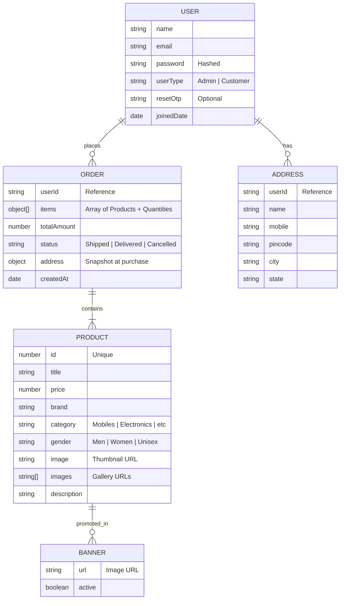

# Database Design & MongoDB Schemas

This document provides a detailed overview of the ShopEZ database architecture, including the **Entity-Relationship (ER) Diagram** and descriptions of each collection and model.

## 📊 Entity-Relationship (ER) Diagram

ShopEZ maintains a scalable relationship between users, their orders, and their addresses.

---

## 🛠️ MongoDB Schemas (Mongoose)

### 1. User Model
- **Location**: `auth-app/backend/models/User.js`
- **Key Fields**:
  - `name`: User's full name.
  - `email`: Primary identifier for login.
  - `password`: Securely stored via **bcrypt** hashing.
  - `userType`: Used for **Role-Based Access Control (RBAC)** to distinguish between Customers and Admins.

### 2. Product Model
- **Location**: `backend/Models/Product.js`
- **Key Fields**:
  - `id`: Numeric index for legacy support.
  - `price`: Floating-point number for accurate totals.
  - `category/gender`: Used for dynamic **Frontend Filtering**.
  - `images`: A mixed string/array field for galleries.

### 3. Order Model
- **Location**: `backend/Models/Order.js`
- **Key Fields**:
  - `userId`: Links the order to a specific account.
  - `items`: Stores a snapshot of the products at the time of purchase to ensure data integrity.
  - `status`: Defaulted to `Shipped`. Admins can update this to `Delivered` or `Cancelled`.

### 4. Address Model
- **Location**: `backend/Models/Address.js`
- **Key Fields**:
  - `userId`: Links the address to a user.
  - `pincode`: Validated numeric string.
  - `city/state`: Used for shipping logistics.

### 5. Banner Model
- **Location**: `backend/Models/Banner.js`
- **Key Fields**:
  - `url`: The image URL displayed in the dashboard slideshow.
  - `active`: Boolean to toggle visibility.
