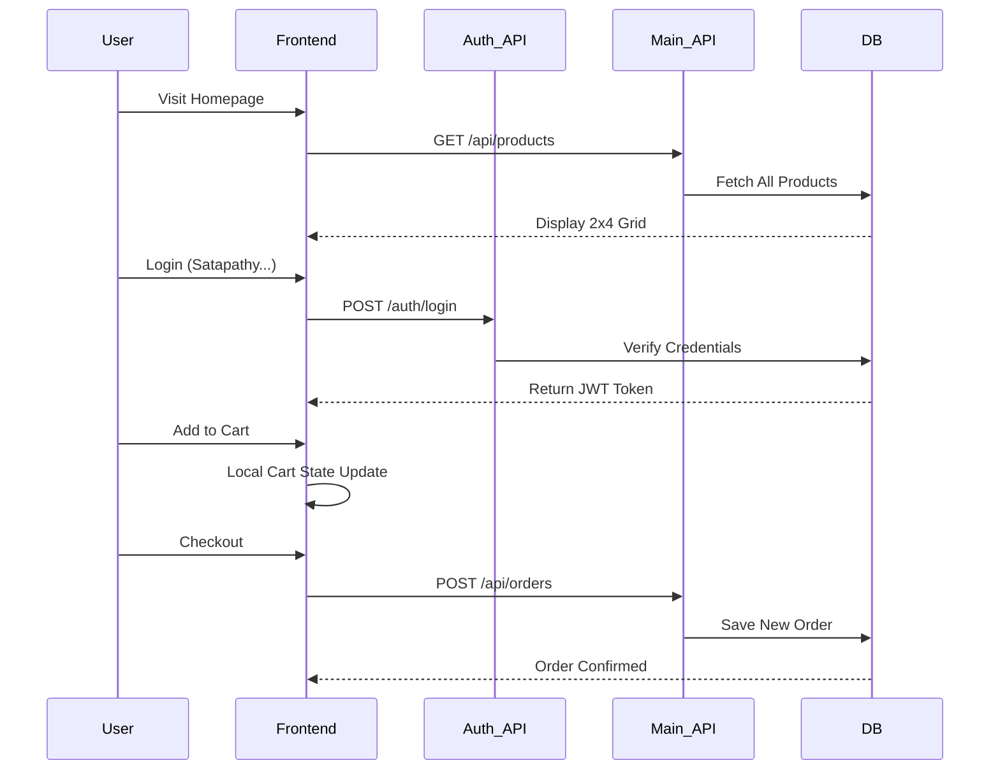

# User Flow & Roles

This document outlines the ShopEZ user journey and the specific responsibilities of each user role within the system.

## 🗺️ User Flow Diagram

The interaction flow for a standard customer journey from discovery to checkout.

---

## 👥 Roles and Responsibilities

### 1. Customer Role
Customers are the primary end-users of the ShopEZ platform.
- **Registration & Security**: Can sign up, log in, and reset forgotten passwords via OTP verification.
- **Product Discovery**: Can browse all products, filter by category or gender, and search by title.
- **Cart Management**: Can add items, adjust quantities, and remove products before checkout.
- **Orders & History**: Can view past order history and current order status (Shipped, Delivered, etc.).
- **Address Management**: Can add, update, and manage multiple shipping addresses.

### 2. Administrator Role
Administrators have access to the **Admin Portal** for platform oversight.
- **User Oversight**: Can view a full list of registered users and total user counts.
- **Product Management**: Can add new products to the inventory and delete old ones.
- **Order Tracking**: Can see all customer orders and update their status (e.g., mark as "Delivered").
- **Marketing Control**: Can update the primary promotional banner displayed on the dashboard.
- **System Stats**: Has a high-level view of total users, total products, and total orders at a glance.
